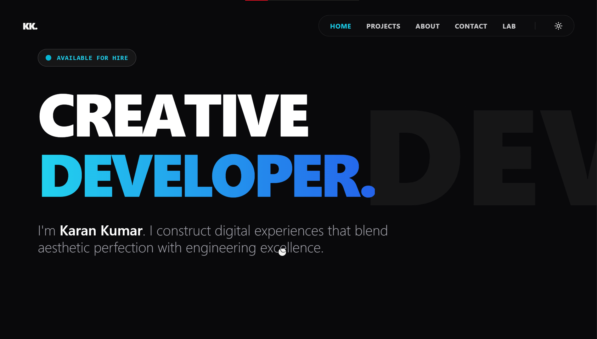

# ⚡ Karan Kumar | Creative Developer Portfolio

> A modern, high-performance portfolio website built to showcase my projects and UI experiments.

 
## 🚀 Live Demo
[**View Live Site**](https://your-portfolio-link.vercel.app)

## 🛠 Tech Stack
* **Framework:** React + Vite
* **Styling:** Tailwind CSS
* **Animations:** Framer Motion + GSAP
* **Routing:** React Router v6 (Dynamic Routes)
* **Forms:** EmailJS
* **SEO:** React Helmet Async
* **Deployment:** Vercel

## ✨ Features
* **Dark/Light Mode:** Persisted theme state with system preference detection.
* **Page Transitions:** Smooth exit/entry animations using `AnimatePresence`.
* **Case Studies:** Dynamic `/projects/:id` routing to showcase detailed project insights.
* **The Lab:** A dedicated section for experimental UI components and micro-interactions.
* **Fully Responsive:** Optimized for all devices from mobile to 4K screens.

## 📦 Run Locally

Clone the project

```bash
  git clone [https://github.com/karankumar-ghub/portfolio.git](https://github.com/karankumar-ghub/portfolio.git)